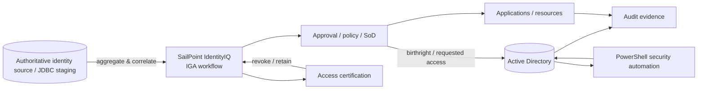

# Enterprise Identity Security Lab

> Evidence-based portfolio reconstruction of Cyber Defense Academy (CDA) 2025 work spanning Active Directory security hardening, PowerShell administration, Identity Governance & Administration (IGA), and IAM operations design.


<p align="center">
  
</p>

> **Visual provenance:** this diagram is derived from the retained CDA IAM/AD workflow and the explicitly labeled 2026 portfolio engineering extensions. It is an architecture map, not a claim that a production SailPoint tenant or enterprise AD environment is publicly reproduced here.

## Senior technical review path

| Review question | Inspect |
|---|---|
| Is AD provisioning safe and idempotent? | [`active-directory/Import-ADUsers.ps1`](active-directory/Import-ADUsers.ps1) |
| How are JML, RBAC and SoD modeled? | [`iam/jml-workflow.md`](iam/jml-workflow.md), [`iam/rbac-model.csv`](iam/rbac-model.csv), [`iam/sod-rules.yml`](iam/sod-rules.yml) |
| What is evidence-backed vs reconstructed? | [`SOURCE_EVIDENCE.md`](SOURCE_EVIDENCE.md), [`PROJECT_PROVENANCE.md`](PROJECT_PROVENANCE.md) |
| What was corrected from the original lab approach? | [`docs/ENGINEERING_REVIEW.md`](docs/ENGINEERING_REVIEW.md) |
| How would changes be validated operationally? | [`docs/VALIDATION_PLAN.md`](docs/VALIDATION_PLAN.md), [`docs/OPERATIONS_RUNBOOK.md`](docs/OPERATIONS_RUNBOOK.md) |
| Are the scripts quality-gated? | [`.github/workflows/powershell-quality.yml`](.github/workflows/powershell-quality.yml), [`tests/Portfolio.Tests.ps1`](tests/Portfolio.Tests.ps1) |

## Why this repository exists

The original CDA work was distributed across Notion assignments, private training PDFs, Google Docs/Sheets, lab notes, screenshots, and team submissions. This repository consolidates the technically relevant work into a reviewable engineering case study **without republishing vendor/training material or sensitive lab data**.

Two evidence layers are kept deliberately separate:

- **2025 retained evidence** — what is supported by the original CDA trackers, team submissions, Google Drive artifacts, and documented lab results.
- **2026 portfolio engineering extension** — cleaned scripts, reproducibility material, security review, tests, operational runbooks, and modernization recommendations created later. These are not presented as if they were executed during the 2025 cohort.

## Portfolio scope

| Area | 2025 evidence | Portfolio implementation |
|---|---|---|
| Active Directory | Password/lockout policy, PSO, Guest hardening, inactive-account review, account-control checks, GPOs | Safe PowerShell audit/provisioning scripts, GPO baseline, validation plan |
| Identity governance | Manual-IAM gap analysis, JML and IdentityIQ design | JML architecture, RBAC model, SoD examples, certification design |
| Security operations | Listening-port inventory, auditing, update/backup requirements | Hardened inventory tooling, event/audit guidance, runbooks |
| Cybersecurity analysis | Team/role and security-tool analysis | Curated operating-model case study |
| IAM operations | Shift/coverage planning artifact with SSO/IGA/PAM skills | Clearly labeled operations-planning exercise; not represented as employment |

## Architecture



The retained Capstone 2 design used a `Not_approved_students` JDBC staging table, IdentityIQ identity creation, birthright provisioning to Active Directory, and an alumni/leaver path. The public examples here are vendor-neutral reconstructions and do not claim that original IdentityIQ workflow XML or connector configuration was retained.

## Engineering highlights

### 1. Active Directory security assessment & remediation

The retained Capstone 1 documentation covers a broad Windows/AD hardening exercise: domain and fine-grained password policies, account lockout, Guest disablement, inactive account review, `PasswordNotRequired`, Kerberos pre-authentication checks, PowerShell policy, listening ports, service hardening, patching, UAC, screen lock, anonymous enumeration, advanced auditing, RDP restriction, LM/NTLMv1 disablement, AD backup, Defender, BitLocker, software inventory, and related GPO validation.

This repository does **not** blindly copy every 2025 instruction. `docs/ENGINEERING_REVIEW.md` records where the original exercise needs stronger operational safeguards or updated guidance.

### 2. Safer identity provisioning

`active-directory/Import-ADUsers.ps1` reconstructs the bulk-user task with safeguards that were missing from the retained classroom snippet:

- validates required CSV fields;
- validates destination OUs before mutation;
- sets the AD `Path` explicitly;
- checks for duplicate `sAMAccountName` values;
- supports `-WhatIf` / `ShouldProcess`;
- does **not** store plaintext passwords in CSV;
- defaults new accounts to disabled unless a `SecureString` temporary password is supplied and enablement is explicitly requested;
- writes an audit log without logging credentials.

### 3. Identity lifecycle / IGA

The original Greenfield IAM capstone identified manual provisioning, missing policy/approval workflows, inconsistent offboarding, weak reporting, and administrative workload as gaps. The documented design then mapped these to IGA capabilities: JML automation, RBAC, approvals, certifications, policy enforcement, centralized visibility, and connector-based provisioning.

The 2026 extension formalizes that into:

```text
Joiner -> authoritative record -> identity correlation -> approval/policy
       -> birthright role -> AD/application provisioning -> evidence

Mover  -> attribute change -> role recalculation -> SoD check
       -> add/revoke entitlements -> recertify elevated access

Leaver -> disable interactive access -> revoke entitlements
       -> move/archive identity -> preserve audit evidence
```

### 4. Verification over screenshots

The public portfolio favors commands, expected-state checks, exported evidence, and automated source-quality tests instead of depending on screenshots. Examples include:

- `Get-ADDefaultDomainPasswordPolicy`
- `Get-ADUserResultantPasswordPolicy`
- `Get-ADFineGrainedPasswordPolicy`
- `gpresult /h ...`
- `auditpol /get /category:*`
- AD account-control queries
- PowerShell-generated CSV/JSON inventories
- GitHub Actions syntax and PSScriptAnalyzer checks

## Repository map

```text
.
├── active-directory/     # Safe PowerShell audit/provisioning examples
├── data/                 # Sanitized sample inputs
├── docs/                 # Architecture, evidence, review, runbooks
├── gpo/                  # Policy baseline and validation guidance
├── iam/                  # JML, RBAC, SoD and IGA design
├── tests/                # Static portfolio tests
└── .github/workflows/    # PowerShell quality gate
```

Start with:

- [`PROJECT_PROVENANCE.md`](PROJECT_PROVENANCE.md) — what can be attributed to whom.
- [`SOURCE_EVIDENCE.md`](SOURCE_EVIDENCE.md) — evidence inventory and confidence.
- [`docs/AD_SECURITY_ASSESSMENT.md`](docs/AD_SECURITY_ASSESSMENT.md) — Capstone 1 security case study.
- [`docs/IGA_ARCHITECTURE.md`](docs/IGA_ARCHITECTURE.md) — Capstone 2 identity-governance case study.
- [`docs/ENGINEERING_REVIEW.md`](docs/ENGINEERING_REVIEW.md) — senior-review corrections and modernization.
- [`docs/OPERATIONS_RUNBOOK.md`](docs/OPERATIONS_RUNBOOK.md) — safe operational sequence.

## Security and ethics

This repository is designed for an isolated lab or an environment you are authorized to administer. It intentionally omits historical credentials, real passwords, private training PDFs, student identifiers, private screenshots, and tenant-specific secrets. Example domains and identities are synthetic.

## Portfolio statement

This is a **curated portfolio reconstruction** of collaborative and individual CDA work. It preserves evidence boundaries instead of claiming that every script or hardening improvement in this public repository existed in the original 2025 submission.
