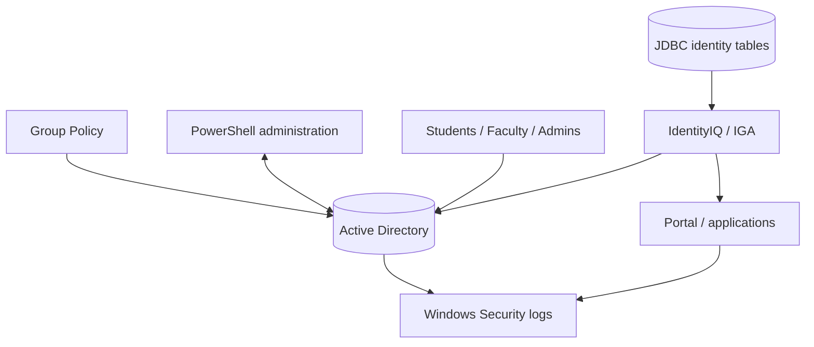

# Architecture

## 2025 lab model

The retained CDA artifacts describe a Windows/identity environment centered on Active Directory, organizational units for different populations, supporting applications/databases, and a later IGA design that introduces SailPoint IdentityIQ-style governance.

## 2026 portfolio control planes

This portfolio separates the system into four conceptual control planes:

1. **Identity source plane** — authoritative user lifecycle data.
2. **Governance plane** — correlation, roles, approvals, SoD, certification.
3. **Enforcement plane** — AD groups/accounts, application entitlements, GPO.
4. **Evidence plane** — logs, inventory exports, approvals and certification history.

That separation is intentional: authentication is not the same as governance, and a directory is not automatically an authoritative HR/SIS source.
