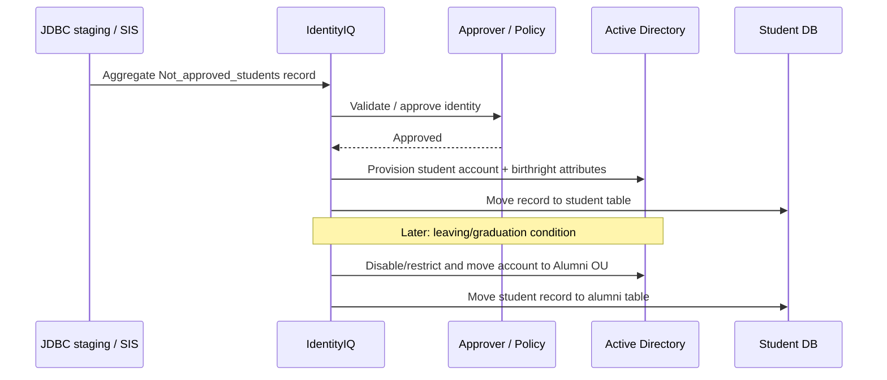

# Greenfield IGA Architecture — Capstone 2

## Evidence status

The retained Capstone 2 Google Doc has direct revision-level attribution to `syfaads16`. It documents both the manual-IAM gap analysis and the proposed IdentityIQ lifecycle.

## Problems identified in the retained artifact

The 2025 document identifies six recurring problems in manual IAM:

- account provisioning is manual and slow;
- access decisions depend on administrators remembering/documenting rules;
- no formal approval workflow or audit trail;
- offboarding can leave orphan accounts;
- no centralized access visibility/reporting;
- administrative workload does not scale.

## Documented IGA response

The source maps those gaps to IGA capabilities including provisioning/deprovisioning, RBAC, lifecycle management, approval workflows, certification, policy enforcement, self-service access request, reporting, and connector integration.

## Documented student JML flow

## 2026 engineering extension

A production-grade implementation should add:

- explicit authoritative-source ownership and correlation rules;
- immutable identity identifiers separate from username/email;
- birthright vs requestable entitlements;
- approval matrices and SoD checks;
- retry/idempotency semantics for provisioning;
- connector failure queues and reconciliation;
- leaver SLA and break-glass handling;
- periodic certification of privileged access;
- auditable reason codes for grants/revokes;
- separation of authentication/SSO from IGA governance.

See `iam/jml-workflow.md`, `iam/rbac-model.csv`, and `iam/sod-rules.yml`.
