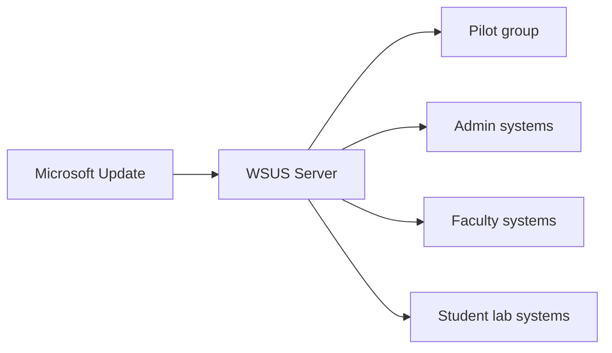

# Patch Management — Completion of the Incomplete WSUS Assignment

> **Status:** 2026 portfolio extension. The retained 2025 material includes Windows Update/WSUS tasks but part of the WSUS configuration sequence was unfinished.

## Lab objective

Provide a centralized update service for a Windows Server / AD lab while separating pilot and broad deployment rings.

## Reference topology



## Deployment sequence

1. Install the WSUS role and management tools.
2. Run post-install configuration and choose update-content/database placement appropriate to lab capacity.
3. Configure TLS/SSL for client-to-WSUS traffic in environments where WSUS is retained.
4. Select only required products, languages, and classifications.
5. Create computer groups such as `Pilot`, `Admins`, `Faculty`, and `Student-Labs`.
6. Configure client GPO to use the intranet update service.
7. Synchronize metadata.
8. Approve updates to `Pilot` first.
9. Validate installation, application compatibility, reboot behavior, and reporting.
10. Promote approved updates to broader rings.
11. Monitor compliance and clean up declined/superseded content.

## Example installation

```powershell
Install-WindowsFeature -Name UpdateServices -IncludeManagementTools -Restart
```

## Release gates

| Gate | Requirement |
|---|---|
| Pilot | Update downloads, installs, reports successfully; no critical app regression |
| Privileged systems | Pilot passes + recovery path documented |
| Broad deployment | Representative device groups pass + maintenance window approved |

## Operational caveat

WSUS is preserved here because it matches the Windows Server lab assignment. It is deprecated and receives no new features, although Microsoft continues to support production deployments according to product lifecycle. A greenfield 2026 endpoint strategy should evaluate currently supported Windows update-management services rather than selecting WSUS by default.
